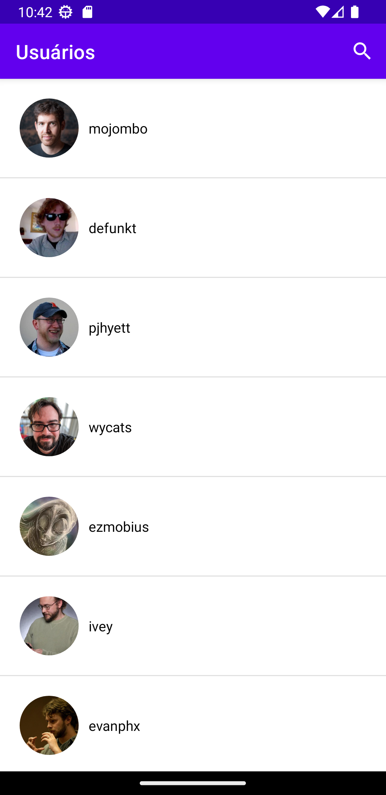
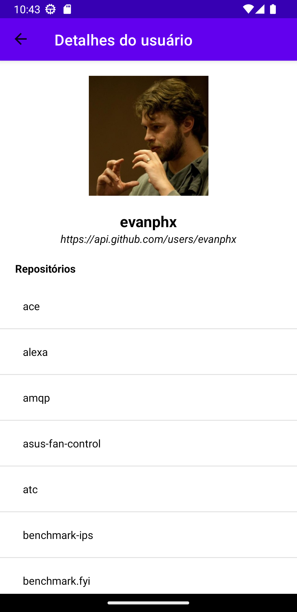

This repository contains Android application based in https://developer.github.com/v3/.

 

## User Stories

1. The first thing a user should see is a list of github users.
2. If taps into an github user the app has to display some details of this user

## Functionality

The app is composed of 2 main screens:

### User List

It allows you to user list. It`s possible search a user by username

### User Details

This screen displays the details of a user

## Technical details

The Application implemented and structured based on the **MVVM** pattern.

The **Data** layer contains **Client** implemented by *Retrofit* library to get access to remote data on [Github API](https://api.github.com/).

The **View** layer is done with the [Android Navigation Component](https://developer.android.com/guide/navigation) including one MainActivity which holds the navigation host fragment.

The **Koin** library does the *dependency injections* in the whole app.

## Libraries

- **Glide** image downloading and caching library made by [bumptech](https://github.com/bumptech/glide)
- **Retrofit** and **OkHttp** API libraries made by [square](https://github.com/square/retrofit)
- **Kotlin Serialization** plugin made by [jetbrains](https://github.com/Kotlin/kotlinx.serialization)
- **Koin** dependency injector library made by [InsertKoinIO](https://github.com/InsertKoinIO/koin)

## Run project

1. Clone this repository to your computer
2. Open Android Studio
3. Select "Open an existing Android Studio project"
4. Navigate to the directory where you cloned the repository and select the project folder
5. Wait for Android Studio to configure the project
6. Connect an Android device to your computer or launch an emulator in Android Studio
7. Click the "Run" button in Android Studio to launch the app on the selected device or emulator

## License

Copyright 2023 Alexander de Oliveira

Licensed to the Apache Software Foundation (ASF) under one or more contributor license agreements. See the NOTICE file distributed with this work for additional information regarding copyright ownership. The ASF licenses this file to you under the Apache License, Version 2.0 (the "License"); you may not use this file except in compliance with the License. You may obtain a copy of the License at

http://www.apache.org/licenses/LICENSE-2.0